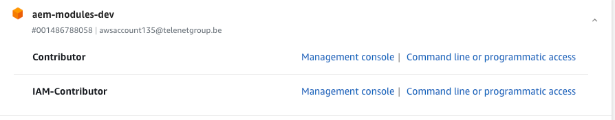

# Monorepo

- [NX Commands](#nx-commands)
- [Quick Start](#quick-start)
  - [IntelliJ run configurations](#intellij-run-configurations)
  - [Library DDD structure](libs/foundation/demo/README.md)
  - [Building and testing](#building-and-testing)
- [Documentation & References](#documentation--references)
  - [Important notes](#important-notes)
  - [Telenet](#telenet)
  - [Official Documentation](#official-documentation)
- [Node management with nvm](#nvm)
- [Using S3 cache](#using-s3-cache)
- [CI Pipeline](#ci-pipeline)
- [Prettier](#prettier)
- [NPM link - Local testing with tcp.angular](#npm-link)
- [Structure](#structure)
- [Troubleshooting](#troubleshooting)
- [Storybook](#storybook)
- [Lighthouse](#lighthouse)
- [Local Run](#local-run)

## Prerequisites

- [Node 20.10.0](https://www.npmjs.com/package/node/v/20.10.0)
- [Npm 10.2.3](https://registry.npmjs.org/npm/-/npm-10.2.3.tgz)

## NX Commands

### Create a new monorepo application

To create an application under the `/app` folder you can run the following command:

`nx generate @telenet/mfe:app --leanIxName foundation --mfeName demo-mfe`

>See [MFE App generator](libs/plugins/mfe/README.md) for more information.


### Convert an existing application into MFE

`nx g @angular-architects/module-federation:init --project APPLICATION_NAME-mfe --port 4205 --type remote`

### Add storybook to an application

`nx generate @nx/angular:storybook-configuration --name=APPLICATION_NAME-mfe --linter=eslint --tsConfiguration --no-interactive`

### See the affected graph

`nx graph`

### Create a library
#### MFE/DDD feature library:
A feature library is a library that contains the main business logic of a bounded context.
To generate a feature called `device` in the `demo-mfe`, domain being `billing` and within the `foundation` leanIX , use the following command:</br>
`nx generate @telenet/ddd:feature device --leanIxName=foundation --mfeName=demo-mfe --domain=billing`
>See [DDD Plugin for Nx](libs/plugins/ddd/README.md) for more information.
#### MFE/DDD UI library:
`nx generate @telenet/ddd:ui --leanIxName=foundation --mfeName=demo-mfe --domain=billing`
>See [DDD Plugin for Nx](libs/plugins/ddd/README.md) for more information.
#### Publishable library:
A publishable library is a library that can be published to npm. It has a package.json file and can be imported into tcp.angular(ex.: _@telenet/ng-lib-ocapi_).</br>
`nx generate @nx/angular:lib LIB_NAME --publishable --importPath=@telenet/ng-lib-LIB_NAME`


## Quick start

### IntelliJ run configurations

Note that IntelliJ integrates with `nvm` to pickup the correct `node` version from the `.nvmrc` file.

Run configurations are available for the most common tasks :

- [mvn] Install node & npm
- [npm] ci
- [npm] run build-all
- [npm] run test-all
- [npm] run lint
- [npm] run format
- [npm] run affected:build
- [npm] run affected:test
- [npm] run dep-graph

## Building and testing

The NX build is using caching to make build & test faster -> it only builds what needs to be build.

### Build and test everything

- build: `npm run build-all`
- test: `npm run test-all`
- lint: `npm run lint`

### Build only what you changed

Use `affected` in nx commands to optimze building and testing on changed files.

- build: `npm run affected:build`
- test: `npm run affected:test`

### Build a specific project

Example for `datalayer` project

- build: `npx nx run datalayer:build`
- test: `npx nx run datalayer:test`
>note: A non-publishable library doesn't have the test target in the project.json file
this happens because it is normally built with the application that uses it
### npm install vs npm ci

Ensure usage of proper node & npm (see [prerequisites](#prerequisites))

Only run an `npm install` when you have added a new library into the package.json.
When the package.json hasn't been changed we should use `npm ci`

## Micro-frontend docker image

This script is used to run your micro-frontend as a Docker image similar to the one deployed on AWS.
It builds the micro-frontend application and optionally the Storybook application, then creates and runs a Docker container with the built application.

### Using script

Bold parameters are optional.\
`sh ./tools/docker/start-micro-frontend-container.sh mfe-app host-port **--with-storybook** **--debug**` <br/>
or<br/>
`sh ./tools/docker/start-micro-frontend-container.sh foundation general-mfe 80 --with-storybook --debug`

#### Parameters

* **LEANIX_APP_FOLDER:** The folder containing the micro-frontend application. This option is required.
* **MFE_APP:** The micro-frontend application name. This option is required.
* **MFE_PORT:** The port on which you want to run the Docker image. This option is required.
* **--with-storybook**: Builds the Storybook application along with the micro-frontend. This option is optional.
* **--debug**: Enables debug logging. This option is optional.

`sh start-micro-frontend-container.sh marketing-mfe 8086`
## Running E2E Tests in a Docker Container
This script starts a Docker container to run E2E tests for a specified client project, simulating the job that is run in GitLab. <br/>
`sh ./tools/docker/start-e2e-in-a-container.sh [CLIENT_E2E] [TESTING_TYPE] [TESTING_FRAMEWORK]`
- **CLIENT_E2E**: The name of the client E2E project. Default is customer-web-billing-invoice-mfe-e2e.
- **TESTING_TYPE**: The type of testing to perform. Options are e2e-integrated or e2e. Default is e2e-integrated.
- **TESTING_FRAMEWORK**: The testing framework to use. Options are playwright or cypress. Default is playwright. <br/>
To run the script with the default values, use the following command: <br/>
`sh ./tools/docker/start-e2e-in-a-container.sh` <br/>
To run the script with custom values, use the following command: <br/>
`sh ./tools/docker/start-e2e-in-a-container.sh customer-web-billing-invoice-mfe-e2e e2e-integrated`

## Documentation & References

### Important notes

- It's highly advised to use [nvm](https://github.com/nvm-sh/nvm) for installation of node & npm
- **Do not** use `npm install` unless you are installing or updating dependencies !
- Having issues ? See [Troubleshooting](#troubleshooting) ...

### Telenet

- [Confluence - AEM shared libraries](https://confluence.rel.apps.telenet.be/display/REP/AEM+-+Shared+NPM+Libraries)
- [Confluence - Dev manual](https://confluence.rel.apps.telenet.be/display/REP/AEM+-+NPM+Libraries+-+Build%2C+Test+and+Deploy+in+Monorepo)

### Official documentation

- NX (monorepo build system) : https://nx.dev
- Lerna (monorepo publishing) : https://lerna.js.org
- Jest (test framework + parallel runner) : https://jestjs.io/docs/expect
- [Deprecated, except for component testing] Cypress (e2e UI testing) : https://www.cypress.io
- Playwright (e2e UI testing): https://playwright.dev/

## Nvm

### .nvmrc

This file is used with `nvm use` so that nvm is going to install the node that is required to build this project.

### Format your code

- format: `npm run format`

### Using S3 Cache

Our monorepo uses S3 Cache between builds.
Whenever you run a build/lint/test locally, with the cache configured, it will generate a hash upload the cache to the
S3 bucket.
Once the cache is uploaded, if you run build/lint/test locally or on a pipeline, if the hash is the same, it will use
the cache instead.
Here is how to use S3 Cache for your builds.

- Create a file called `.env`
- Login to AWS via https://login.connect.telenet.be/
-  click on the link Command line or programmatic
  access
- Copy the AWS environment variables to your `.env` file
  - AWS_ACCESS_KEY_ID="XXXXXXXX"
  - AWS_SECRET_ACCESS_KEY="XXXXXXXX"
  - AWS_SESSION_TOKEN="XXXXXXXX"

### See the dependency graph

- `npm run dep-graph`

## Structure

### /apps

Client applications that will be tested with jest for unit testing\
Playwright will be used in the client-e2e

### /libs

Libraries that will be compiled together with the client and it will also be published with lerna to use in tcp.angular

### /tools

generators, jest configuration or scripts for the libs and clients

# CI Pipeline

NX provides some ways to determine what projects have been changed. We can leverage that in our pipeline to only build
and deploy the parts of the monorepo that have been touched in a certain revision.

## Overriding the affected apps behaviour

| Options for overriding                                | Effect                                                                                            |
|-------------------------------------------------------|---------------------------------------------------------------------------------------------------|
| OVERRIDE_AFFECTED_CLIENTS: ''                         | Default behaviour. Will determine the affected clients by comparing a base branch and a HEAD      |
| OVERRIDE_AFFECTED_CLIENTS: 'ALL'                      | Will build and deploy all the client projects, regardless of changes.                             |
| OVERRIDE_AFFECTED_CLIENTS: 'fleet-mfe'                | Will build and deploy the fleet-mfe client project, regardless of changes.                        |
| OVERRIDE_AFFECTED_CLIENTS: 'fleet-mfe, marketing-mfe' | Will build and deploy the fleet-mfe and the marketing-mfe client projects, regardless of changes. |

# Prettier

https://prettier.io/docs/en/index.html

### Format uncommitted files

`nx format:write --uncommitted`

### Format files based on a branch

`nx format:write --base=develop .`

## NPM Link

### Linking

Unfortunately using `npm link` to link a local package defined in this monorepo does not work.
To still be able to test out package changes on the consumer side (e.g. `tcp.angular`), we can
use `yalc` to symlink these packages in a correct way.

_Scenario_: Changes in `ImageSrcPathDirective` in the `@telenet/ng-lib-page`

1. Go to the build library under `libs/page/dist` (this contains the package to be published to the NPM registry)
2. `npx yalc publish` - Creates a symlink
3. Go to the project that has `@telenet/ng-lib-page` as a dependency and needs the changes tested
4. In the folder where the `package.json` lives, run `npx yalc link @telenet/ng-lib-page`
5. Build your project without reinstalling dependencies (in `tcp.angular` use )

#### Updates

When doing updates to your yalc'ed package, run `npx yalc publish` in the `dist/` directory of your yalc'ed package.

### Unlinking

Unlinking a previously symlinked dependency can be done by running `npm ci` in the root of your project where you are
using the linked package.
You may also need to clear your Angular cache using `npx ng cache clean` in that same directory.

## Troubleshooting

1. Check if you use the correct node and npm version (see [prerequisites](#prerequisites) )
1. Automatic solution : use provided IntelliJ run configs
2. Manual solution : install a node version manager [nvm](https://github.com/nvm-sh/nvm)
2. Delete your ./node_modules folder and run `npm ci` again.

## Storybook

Our Storybook is configured to automatically detect stories across all libraries.

During development, if you add
a [story](https://storybook.js.org/tutorials/intro-to-storybook/angular/en/simple-component/) to any library, Storybook
will automatically recognize and include it.
To launch the shared Storybook, execute the command: npm run storybook.

Additionally, you can access the published version of our shared Storybook
at https://monorepo-storybook.aem-modules-dev.awscloud.external.telenet.be/

## Local Run via the terminal

Run all **tests** for a specific MFE

`node ./tools/scripts/execute-target-for-given-target-and-tags.js --target=test --tags="scope:sales-mfe" --code-coverage --runInBand`

Run all **component testing** for a specific MFE

`node ./tools/scripts/execute-target-for-given-target-and-tags.js --target=component-test-coverage --tags="scope:demo-mfe"`

Run all **lint** for a specific MFE

`node ./tools/scripts/execute-target-for-given-target-and-tags.js --target=lint --tags="scope:demo-mfe"`

## Lighthouse

Lighthouse is currently added as a dev dependency and can be used in 2 ways

### Command line

```lhci collect --url=https://demo-mfe.orb.local/ --numberOfRuns=3```

### Ligthhouserc

Create a local file (it is gitignored) called `lighthouserc.js`

```
module.exports = {
  ci: {
    collect: {
      url: ['https://demo-mfe.orb.local/']
    },
    upload: {
      target: 'temporary-public-storage',
    }
  },
};
```

Then run it with `lhci autorun`


