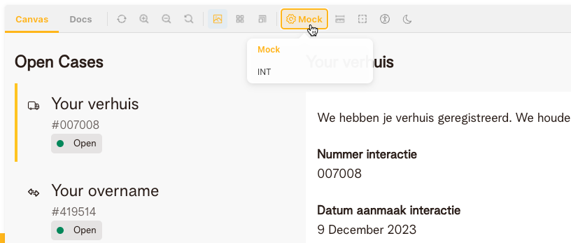

# Care Service Cases MFE
## Testing
`nx affected:test`
## Storybook
Run this command to run storybook for this app:
`nx run care-service-cases-mfe:storybook`

### Connect from storybook to OCAPI backend services
To connect to backend services, you should run storybook with SSL enabled 
1. Change the `storybook-ssl` script in `package.json` to point to your SSL certificate (sslCert) and key (sslKey).
```
"storybook-ssl": {
      "executor": "@storybook/angular:start-storybook",
      "options": {
        "port": 4200,
        "configDir": "apps/engagement/care-service-cases-mfe/.storybook",
        "browserTarget": "care-service-cases-mfe:build-storybook",
        "compodoc": false,
        "styles": ["apps/engagement/care-service-cases-mfe/src/styles.scss"],
        "host": "local.telenet.be",
        "https": true,
        "sslKey": "%SSL_KEY_PATH%/localhost.key",
        "sslCert": "%SSL_KEY_PATH%/localhost.crt"
      },
      "configurations": {
        "ci": {
          "quiet": true
        }
      }
    }
```
2. Run:
`nx run care-service-cases-mfe:storybook-ssl`
3. Open your browser and go to `https://local.telenet.be:4200/`
4. Change the toolbar setting to use INT environment


