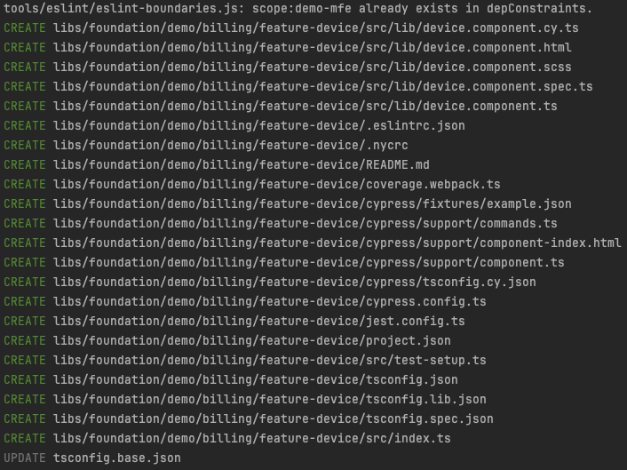

# @telenet/ddd -- DDD Plugin for Nx

The `@telenet/ddd` plugin provides a generator that creates a complete library in your Monorepo, based on the [nx-ddd-plugin](https://www.npmjs.com/package/@angular-architects/ddd) from NX. This generator supports the creation of libraries with feature, UI, and data-access components, and includes configurations for Cypress testing and unit testing with coverage.
> ⚠️ Please read this README carefully. It is important to use the generator correctly to ensure that your library is created with the recommended folder structure provided by the Monorepo team.

## Features

* 🗺️ Generate a library with feature library, UI component, and optionally NGRX functionality (--ngrx switch)
* ⚙️ Fully configured for testing using Jest and Cypress (with coverage)
* 🙅‍♂️ Adds linting

## Usage

The plugin is included in the Monorepo project and does not require separate installation.
There are 2 ways to generate a library:
* UI
* Command line

> ℹ️ The **LeanIX name**, **MFE name**, and **domain name** are mandatory properties. These are necessary to create the correct folder structure and to generate accurate (ts)config, coverage, and other related files.

### Command line
> ℹ️ **_Rule of thumb:_** In almost every case, you need to execute the command from the root of the project. If you define the LeanIX name, MFE name, and domain name, the generator will create the correct folder structure for you or use the existing folder structure. If your folder structure differs from leanIX/mfeName/domain, you can manually create the folders and execute the command from the desired directory. Please contact someone from the monorepo team if you have a custom folder structure.

To generate a feature called `device` in the `demo` domain and within the `foundation` leanIX , use the following command:
```
nx generate @telenet/ddd:feature device --leanIxName foundation --mfeName demo-mfe --domain billing
```


If you only provide the feature name, you will be prompted to input the other mandatory properties via the command line:
```
nx generate @telenet/ddd:feature device
```


For NGRX support, add the `--ngrx` switch:
```
nx generate @telenet/ddd:feature device --leanIxName foundation --mfeName demo-mfe --domain billing --ngrx
```

This command creates a data-access folder with:
* NGRX classes (actions, effects, reducer, selectors, state)
* Facade class
* Service class
* Model


To generate a UI component, use the following command:
```
nx generate @telenet/ddd:ui --leanIxName foundation --mfeName demo-mfe --domain billing
```


### UI
Prerequisite:

* install Nx Console plugin
  * Jetbrains: https://plugins.jetbrains.com/plugin/21060-nx-console
  * VSCode: https://marketplace.visualstudio.com/items?itemName=nrwl.angular-console

> **_Best practice:_** When using the UI, we recommend you do it like this:
>	*	If your domain, MFE, or LeanIX folder is not yet present: right-click on the libs folder and select Nx Generate (UI).
> * If the complete folder structure is already present: right-click the existing domain folder and select Nx Generate (UI).


#### Existing folder structure example
Right-click on your domain folder `libs/foundation/demo/billing` and select `Nx Generate (UI)`.


You can visually enter all the details to generate your library. Each time you change a value, the UI triggers a dryRun to show the outcome in the terminal. Once satisfied, click the `Generate` button on the top right.


## Generated Structured
The structure of a generated library with a feature, NGRX, and a UI component executed from the project root folder looks like this:


In this case **foundation** is the LeanIX name, **demo** is the mfe name and **billing** is the domain.

If you want to manually create a folder structure, you can do so by creating the folders yourself and navigating to the folder where the library should be created. Then, right-click on the folder and select `NX Generate (UI)` to generate the library in this folder.

Example:

You want a structure like this project:


In this case it is best to create the following folders manually: `foundation/telenet/activate` and use the command line after navigating to this folder:

```
cd libs/foundation/telenet/activate
nx generate @telenet/ddd:feature device --domain activate --leanIxName foundation --app telenet-mfe --ngrx
```

Alternatively, right-click your activate folder and select `NX Generate (UI)`

Each feature, data-access, or UI folder generates its own config files:
* data-access
* feature
* UI

data-access   | feature         | UI
------------- | --------------- | -------------
  |     | 
