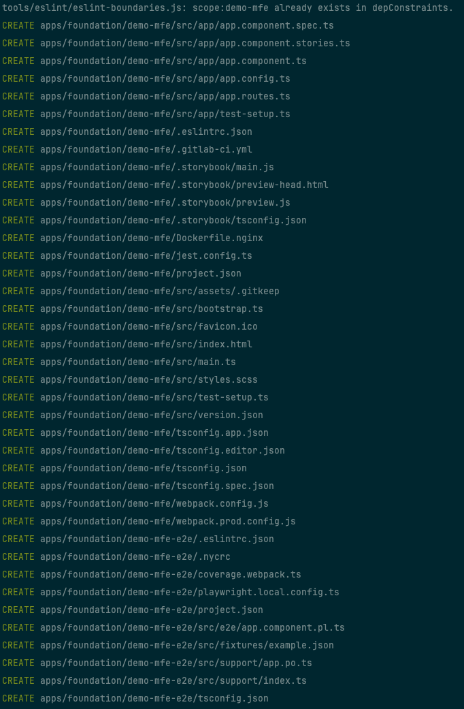
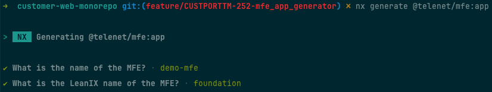
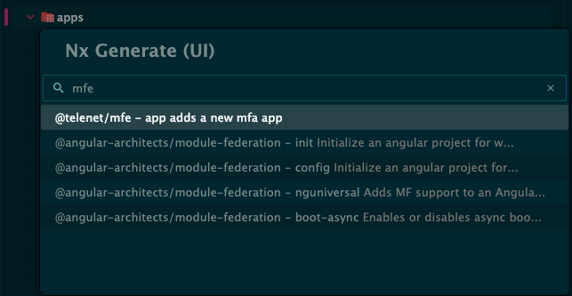
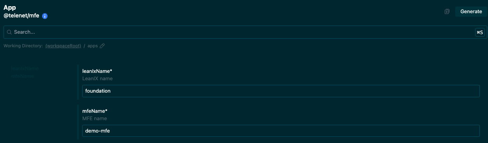

# @telenet/mfe -- MFE App generator

The @telenet/mfe plugin provides a generator that creates a complete MFE App in our Monorepo.

## Usage
The plugin is included in the Monorepo project and does not require separate installation.

### Command line
```
nx generate @telenet/mfe:app --leanIxName foundation --mfeName demo-mfe
```


If you only provide the generator name, you will be prompted to input the other mandatory properties via the command line:
```
nx generate @telenet/mfe:app
```


### UI
Prerequisite:

* install Nx Console plugin
  * Jetbrains: https://plugins.jetbrains.com/plugin/21060-nx-console
  * VSCode: https://marketplace.visualstudio.com/items?itemName=nrwl.angular-console


Right-click on your apps folder and select `Nx Generate (UI)`.


You can visually enter all the details to generate your MFE. Each time you change a value, the UI triggers a dry run to show the outcome in the terminal. Once satisfied, click the Generate button on the top right. 


